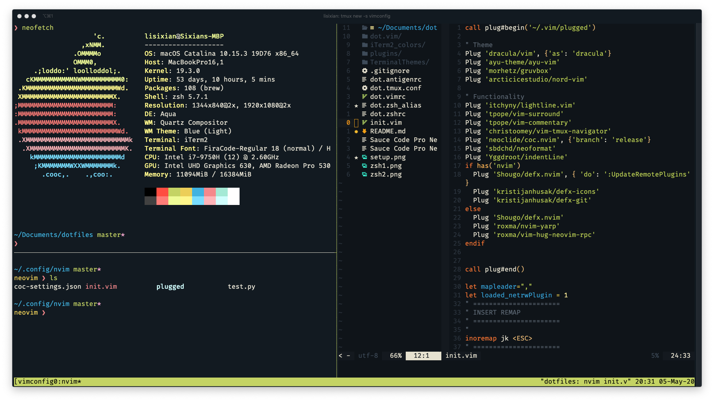

# My Setup

Quickly set up my favorite working environment wherever I go.

---

## MacOS

- Package manager: Homebrew

  ```shell
  /usr/bin/ruby -e "$(curl -fsSL https://raw.githubusercontent.com/Homebrew/install/master/install)"
  ```

- Terminal emulator: iTerm2

- Shell: zsh

  - Font: Fira Code

I use [Antigen](https://github.com/zsh-users/antigen) as the plugin manager. All plugins are in `dot.antigenrc`

My iTerm2 + tmux + Neovim:



Old terminal:


- Markdown editor: [Typora](https://typora.io/)

* Text editor: Neovim (config in `dot.init.vim`)
